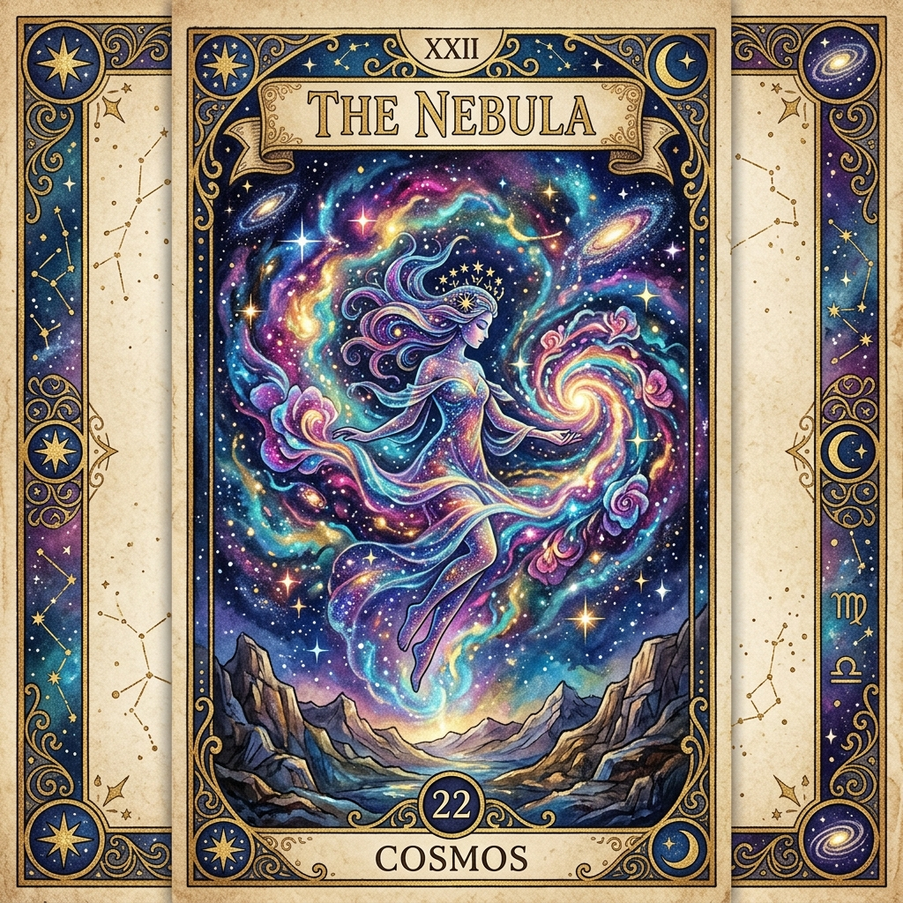
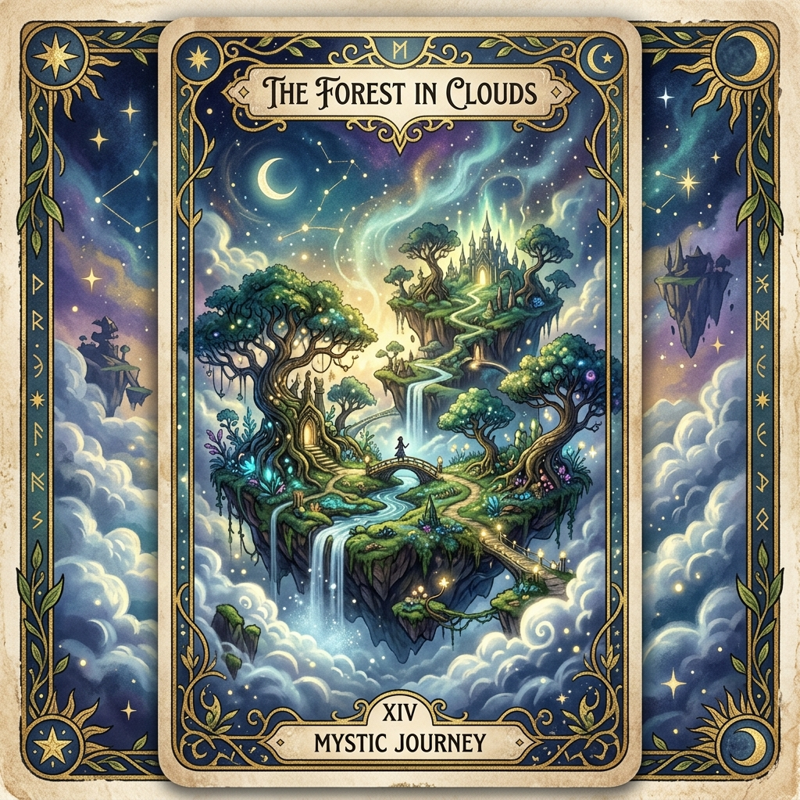
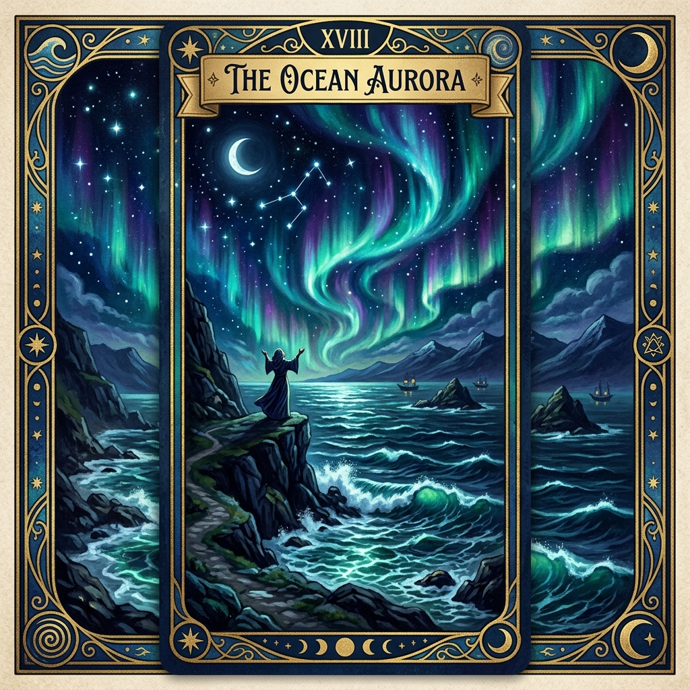

# 🔮 Fortune Gacha App

Fortune Gacha, günlük asistanlık, oyunlaştırma ve yapay zekayı birleştiren mistik, modern sosyal bir mobil uygulamadır.

Her gün sadece bir kez, kendi falınızı çekebilir ("Gacha" mekaniği ile), şansınıza düşen nadirliğe (Common, Uncommon, Rare, Legendary) göre benzersiz görsellerle desteklenmiş fallar elde ederseniz. Özellikle üst seviye (Rare ve Legendary) kartlar OpenAI (DALL-E 3 ve GPT-4o) güvencesiyle tamamen size özel olarak, o günkü kişisel titreşiminize göre üretilir.

---

## 📸 Ekran Görüntüleri & Gacha Çıktıları

### Standart Fallar (Common)



### Nadir Fallar (Uncommon / Rare / Legendary)


*(Görseller temsilidir. Rare ve Legendary fallar çalışma zamanında DALL-E 3 aracılığıyla özel oluşturulur.)*

---

## 🚀 Teknolojik Altyapı

*   **Frontend (Mobile & Web):** React Native, Expo, Expo Router, NativeWind (Tailwind CSS v3/v4), TypeScript.
*   **Backend (API):** C# .NET 8 Web API, Entity Framework Core (SQLite).
*   **Gerçek Zamanlı İletişim (WebSockets):** ASP.NET Core SignalR (Canlı bildirimler ve hediyeleşme).
*   **Yapay Zeka (AI):** OpenAI (DALL-E 3 Görüntü Üretimi & GPT-4 Metin Yorumlama).
*   **Bildirim Mimari:** Expo Push Notifications.

---

## 🔥 Temel Özellikler

1.  **Günlük Gacha Çekilişi (Daily Fortune):**
    Kullanıcılar her gün giriş yaptıklarında bir Gacha kutusu açma hakkı kazanırlar.
2.  **Yapay Zeka Entagrasyonu:**
    Common ve Uncommon kartlar statik bir görsel havuzundan rastgele çekilirken, Rare ve Legendary fallarında **Prompt Engineering** devreye girer. API arka planda sizin için kişiselleştirilmiş bir Tarot kartı görselleştirir (DALL-E 3) ve bir fal metni yorumlar.
3.  **Vitrin (Showcase) ve Sosyal Deneyim:**
    Kullanıcılar çektikleri falları saklayıp, profillerindeki "Showcase" (Vitrin) bölümünde sergileyebilir, böylece diğer arkadaşları bu falları görebilir, beğenebilir ve onlara canlı ("SignalR") bildirim gönderebilirler.
4.  **Arkadaşlık Sistemi:**
    Diğer kullanıcıların profilini görüntüleme, arkadaş olarak ekleme.
5.  **Oyunlaştırma (Gamification):**
    Uygulama içi etkinlikler yaparak "Gacha Point" (GP) ve "Rozetler / Başarımlar" kazanın. Kazandığınız bu özel materyaller profilinizi tamamen özelleştirebileceğiniz bir ekosistem sağlar.

---

## 🛠️ Kurulum & Geliştirme (Local Development)

### Gereksinimler
*   [Node.js (LTS)](https://nodejs.org/en/)
*   [.NET 8 SDK](https://dotnet.microsoft.com/download)
*   Expo Go (Telefon İçin) veya Android Studio / Xcode Emülatörleri.

### REST API (Backend) Kurulumu
1. `src/FortuneGacha.Api` klasörüne gidin.
2. `appsettings.json` içerisine `OpenAI:ApiKey` bilginizi girin.
3. Terminalde şu komutları çalıştırın:
```bash
dotnet restore
dotnet run
```
API varsayılan olarak `http://localhost:5131` adresinde ayağa kalkacaktır (Ve Swagger arabirimi devreye girecektir).

### Expo (Frontend) Kurulumu
1. `src/FortuneGacha.Client` klasörüne gidin.
2. Bağımlılıkları yükleyin:
```bash
npm install --legacy-peer-deps
```
3. Expo Metro Bundler'ı başlatın:
```bash
npx expo start
```
Telefonunuzdaki Expo Go ile karekodu okutabilir veya `w` tuşuna basarak web deneyiminden yararlanabilirsiniz.

---

## 📜 Lisans

Bu proje kişisel kullanım/test için hazırlanmıştır. Ticari lisans ve haklar geliştiricisine aittir.
